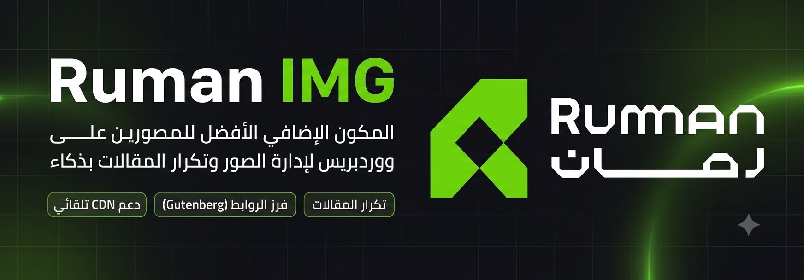

<div dir="rtl">



# Ruman IMG — إضافة ووردبريس للمصورين

إضافة ووردبريس تُوفّر للمصورين أداةً لتحويل أكواد تضمين الصور من مواقع الاستضافة الخارجية إلى معرض موحّد، مع إمكانية نسخ المقالات بنقرة واحدة.

---

## المشكلة التي تحلّها

المصورون الذين يبنون مواقع ووردبريس يرفعون عادةً مئات الصور في جلسة تصوير واحدة إلى مواقع استضافة الصور (مثل imgur و ibb)، ثم يلصقون أكواد التضمين في مقالاتهم. هذا الأسلوب يعاني من مشكلتين:

1. **أكواد التضمين غير موحّدة** — كل موقع استضافة يُنتج كوداً مختلفاً، وكثير منها يعرض الصور بجودة متوسطة بدلاً من الأصلية.
2. **لا توجد طريقة سريعة لنسخ المقالات** — بمجرد أن ينشئ المصور قالب مقال مثالياً، يريد تكراره بسرعة للمقالات الجديدة.

---

## المميزات

### 🖼️ بلوك محلّل الصور (Image Parser Block)
- الصق أكواد التضمين HTML من أي موقع مدعوم أو قائمة روابط مباشرة
- يكتشف الصور تلقائياً ويحوّل جميع الروابط إلى الجودة الأصلية
- يعرض معاينة مصغّرة فورية داخل محرر جوتنبرج
- **إعادة ترتيب الصور بالنقر**: انقر على صورة لاختيارها (تتبع المؤشر)، ثم انقر على صورة أخرى لمبادلة موضعيهما قبل النشر
- زر **"لصق في المقال"** — يُضيف الصور مباشرةً كبلوك HTML في المقال بالترتيب الذي اخترته
- زر **"نسخ الكود الناتج"** — ينسخ الكود النظيف إلى الحافظة
- روابط سريعة لجميع مواقع الاستضافة في الشريط الجانبي
- **أداء عالي مع الدُفعات الكبيرة**: يعالج حتى 300 صورة بتحميل تدريجي دون تعطيل الخادم

### 📋 نسخ المقالات (Post Duplicate)
- رابط **"تكرار"** في قائمة المقالات وفي شاشة التعديل
- ينشئ نسخة مطابقة بحالة مسودة تشمل جميع البيانات الإضافية والتصنيفات
- يُعيد التوجيه تلقائياً إلى المقال الجديد للتعديل الفوري

### ⚙️ لوحة إدارة احترافية
- إحصائيات المقالات
- روابط سريعة لمواقع رفع الصور
- إعدادات لغة الإضافة (عربي / إنجليزي / تلقائي)

---

## مواقع الاستضافة المدعومة

| الموقع | النطاق | هل يحتاج تصحيح الرابط؟ |
|---|---|---|
| **Imgur** | `imgur.com` | لا — الرابط أصلي |
| **imgBB** | `ibb.co` | لا — الرابط أصلي |
| **FreeImage.host** | `freeimage.host` | **نعم** — يُزيل رمز الحجم `.md.` من الرابط |
| **PostImg** | `postimg.cc` | لا — الرابط أصلي |
| **ImgBox** | `imgbox.com` | **نعم** — يُحوّل الصورة المصغّرة إلى الأصلية |

> يدعم البلوك تنسيقين: أكواد HTML الجاهزة من مواقع الاستضافة، أو قائمة روابط مباشرة (رابط واحد في كل سطر).

---

## التثبيت

### الطريقة الأولى — رفع ملف ZIP (الأسهل)
1. نزّل أحدث إصدار من [صفحة الإصدارات](https://github.com/rumanagency/RumanIMG/releases)
2. في لوحة تحكم ووردبريس: **الإضافات ← أضف جديدة ← رفع إضافة**
3. اختر الملف المضغوط ثم انقر **ثبّت الآن**
4. فعّل الإضافة

### الطريقة الثانية — استنساخ المستودع (للمطورين)
```bash
cd wp-content/plugins/
git clone https://github.com/rumanagency/RumanIMG.git rumanimg
cd rumanimg
npm install
npm run build
```
ثم فعّل الإضافة من لوحة التحكم.

---

## طريقة الاستخدام

### لصق أكواد التضمين
1. افتح مقالاً في محرر جوتنبرج
2. أضف بلوك **"Ruman IMG — Image Parser"**
3. الصق أكواد التضمين من موقع الاستضافة أو قائمة الروابط المباشرة في خانة النص
4. تظهر الصور فوراً في المعاينة مع عدد الصور المكتشفة
5. انقر **"لصق في المقال"** لإضافة الصور كمحتوى HTML في المقال

### نسخ مقال
- **من قائمة المقالات:** انقر رابط **"تكرار"** تحت اسم المقال
- **من شاشة التعديل:** انقر زر **"Duplicate this post"** في صندوق النشر

---

## المتطلبات

| المتطلب | الحد الأدنى |
|---|---|
| PHP | 7.4 أو أعلى |
| WordPress | 5.8 أو أعلى |
| محرر الكتل (Gutenberg) | مفعّل |

---

## بناء الإضافة (للمطورين)

```bash
# تثبيت التبعيات
npm install

# وضع المراقبة (تطوير)
npm run start

# بناء للإنتاج
npm run build
```

ملفات البناء تُحفظ في مجلد `build/`.

---

## المطور

<table>
<tr>
<td><strong>المطور</strong></td>
<td>صالح</td>
</tr>
<tr>
<td><strong>الشركة</strong></td>
<td>وكالة رمان</td>
</tr>
<tr>
<td><strong>البريد</strong></td>
<td><a href="mailto:saleh@ruman.sa">saleh@ruman.sa</a></td>
</tr>
<tr>
<td><strong>الموقع</strong></td>
<td><a href="https://ruman.sa">ruman.sa</a></td>
</tr>
</table>

---

## الترخيص

GPL-2.0-or-later — هذا البرنامج مرخّص بموجب [رخصة GNU العامة الإصدار 2](https://www.gnu.org/licenses/gpl-2.0.html) أو أي إصدار لاحق.

</div>
